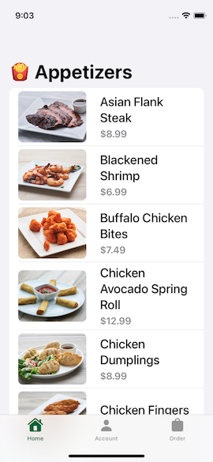
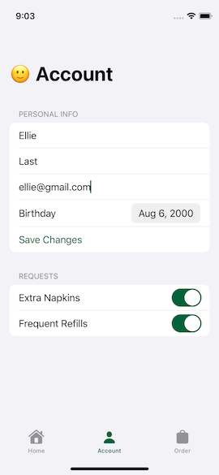

# Appetizers21
Appetizers21 is a take-home project to practice and learn iOS development. Learning how to fetch JSON data, caching and showing alerts,
is the main goal of this App.

## Screens




## App Store
This App is not available on the App Store.

## Used Technologies
- Swift 5.5
- SwiftUI
- Codable
- JSON
- Combine (for getting JSON data)
- XCTest
### SwiftUI
- Form, Section
- ProgressView
- TabView
- Toggle

## Learnings
### General
- We don't need [Almofire](https://github.com/Alamofire/Alamofire) to make basic network calls
- For creating a loading view with a spinner we now can use the ProgessView() struct in SwiftUI
- A [Gaussian Blur](https://en.wikipedia.org/wiki/Gaussian_blur) can be added to any SwiftUI View with .blur()
- A List can be disabled with .disabled()
- Put the @State vars as @Published into the ViewModel
- [@ObservedObject vs @StateObject](https://medium.com/swlh/understanding-stateobject-in-swiftui-for-ios-14-98c68310154a)
- @StateObject property wrapper persists the value during the rendering of the view
- [Reducers](https://www.hackingwithswift.com/example-code/language/how-to-use-reduce-to-condense-an-array-into-a-single-value) let us reduce values into a single one
- [Trainling clousure syntax can be used, when a closure is the last parameter in a function](https://www.hackingwithswift.com/example-code/language/what-is-trailing-closure-syntax)
### SwiftUI
- Whenever we want to update a view, we need some @State
- [Alerts in iOS15](https://www.hackingwithswift.com/quick-start/swiftui/how-to-show-an-alert)
- @AppStorage is SwiftUI's way of interacting with UserDefaults. It will watch an item in UserDefaults and when that changes
it behaves like a state variable and triggers an UI update.
- [@AppStorage has also its downsides](https://www.avanderlee.com/swift/appstorage-explained/)
- [SwiftUI tips and tricks](https://www.hackingwithswift.com/quick-start/swiftui/swiftui-tips-and-tricks)
### UserDefaults
- Shall ONLY be used for storing some lightweight user preferences! 
- Gets deleted when the App is deleted! So don't save any user critical data in there!
### NSPredicate
- [A Predicate is a filter](https://www.hackingwithswift.com/read/38/7/examples-of-using-nspredicate-to-filter-nsfetchrequest)
- [Core Data String Queries using NSPredicate](https://www.advancedswift.com/core-data-string-query-examples-in-swift/)
- [PredicateKit](https://github.com/ftchirou/PredicateKit)
### NEW async/await (introduced at WWDC21)
- A lot of stuff gets abstracted away with async/await (not necessarly having less lines of code):
	- putting manually things onto the main queue/thread explicitly
	- completion handler handeling all the exists
	- doing the weak self dance
- [Is a welcome change on the testing side of the codebase!](https://mokacoding.com/blog/how-to-test-async-await-code-in-swift/)
### AsyncImage
- [A simple way to download and render a remote image from a URL](https://wwdcbysundell.com/2021/using-swiftui-async-image/)
- Pros: easy way to asynchronously load and display an Image
- Cons: offers no cachihg of already loaded Images!
### Property Wrappers for handling and passing data
- @State: SwiftUI will manage the state of a struct property separately for us so that it doesn't get destroyed when a struct view gets recreated.
When a @State value changes, the view invalidates is appearance and recomputes the views body. @State is used for private properties that belong
to a specific view and never get used outside of its local scope.
- @StateObject: used to observe an object which conforms to the ObservableObject protocol (eg. viewModel). The body of a view will be recreated
when this object changes.
- @Binding: It connects a property to a source of truth stored elsewhere and can r&w its value.
    - For prototyping, we can use a constant binding: .constant()
- @ObservableObject: used when passing in a value (e.g. viewModel class) from outside (reference) that shall be observed. Get's destroyed when a view gets recreated!
- @EnvironmentObject: used to observe an object which is supplied by a parent view to its ancestor views.
- [Some differences](https://www.hackingwithswift.com/quick-start/swiftui/whats-the-difference-between-observedobject-state-and-environmentobject)
### Optionals
#### unwrapping
- if let...
- [guard let...](https://www.hackingwithswift.com/quick-start/beginners/how-to-unwrap-optionals-with-guard) is an early return to check wether something
is valid right at the start or if we have to exit (with return) straight away.
- [nil coalescing](https://www.hackingwithswift.com/quick-start/beginners/how-to-unwrap-optionals-with-nil-coalescing) : ```<optional> ?? <defaultValue>```
#### 
- [optional 'try?'](https://www.hackingwithswift.com/quick-start/beginners/how-to-handle-function-failure-with-optionals) to have a function returning
an optional value. (The function will return nil if an error is thrown.)
## Code comments
For learning purposes, I have added lots of comments alongside the code. I know that this would propably be ommitted in 'production' code ;)

## Testing with XCTest/XCUITest
As a Tester I have the natural intrinsic  behavior of adding some Tests to my own written code. From my point of view it does not matter wether one does that
in a TDD or 'after the code is written' fashion. As an automation engineer coming from the Selenium/Appium automation world, I am impressed how
fast the UI Test run on a Simulator with XCTest.
So in this project I have for the very first time in my life ever, written some Unit- and UI-Tests with pure XCTest. Have a look and enjoy! (More to come)
### Unit-Tests
- [Unit tests best practices in Xcode and Swift](https://www.avanderlee.com/swift/unit-tests-best-practices/)
- [Getting started with Unit-Testing](https://www.youtube.com/watch?v=F5aDfGNdsac)
### UI-Tests
- [Xcode UI Testing Cheat Sheet](https://www.hackingwithswift.com/articles/148/xcode-ui-testing-cheat-sheet)
    - use .accessiblityIdentifier() to specify the identity of a view. It is used for testing purposes only and not for user accessibility.
    - prefer waitForExistence(timeout:) over a regular exists check
    - prefer using 'firstMatch' over 'element'

## Credits
Thanks to Sean Allen for an amazingly well structured and tought SwiftUI Fundamentals course!
